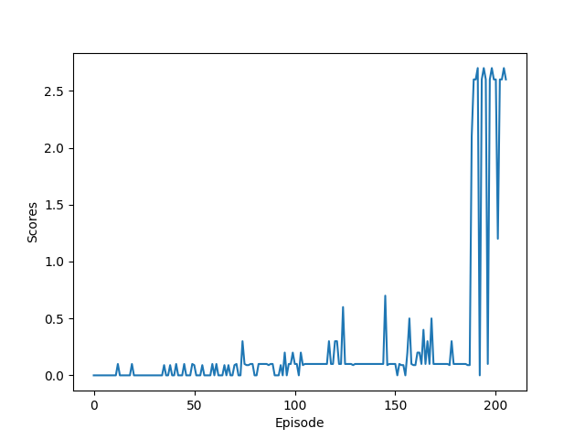

# Project 3: Collaboration and Competition
### Environment  
```
Unity Academy name: Academy
        Number of Brains: 1
        Number of External Brains : 1
        Lesson number : 0
        Reset Parameters :
		
Unity brain name: TennisBrain
        Number of Visual Observations (per agent): 0
        Vector Observation space type: continuous
        Vector Observation space size (per agent): 8
        Number of stacked Vector Observation: 3
        Vector Action space type: continuous
        Vector Action space size (per agent): 2
        Vector Action descriptions: , 
```
This environment has 
- 2 agents
- 2 action space/agent (forward or backward, and jump)
- 8 states space/agent (the position and velocity of the ball and racket)
- 3 consecutive frames: 8*3 = 24 states given to the network input  

### Introduction
MADDPG(Multi-Agent Deep Deterministic Policy Gradients) has been used to solve this reacher environment in continous spaces.     
In this MADDPG, there are 2 DDPG agents to play a tennis game in a collaborative way to earn the maximum scores. For each agent,  
there is an actor and a critic network each of which has a local and target network, similar to DQN (Deep Q-Network) reinforcement learning.  
The actor network is learning to estimate the optimal actions which will be validated by the critic network during training to improve the actor (local)network.   

Actor network: Input:states | Output:actions  
Critic neowk: Input:states,action | Output: Q action value  

**Q Network**  
The networks are defined in `model.py`. In this tennis environment, we are using 3 fully connected layers with RELU, tanh activation and batch normalisation.
By default, the actor and critic has a similar network where it has input and output of each layer as follows.  

(Actor network)
```
input layer:  Relu(batch_norm(linear[state_size, 128]))  
hidden layer: Relu(batch_norm(linear[128, 128]))  
output layer: tanh([128, action_size])   
```

(Critic network)
```
input layer:  Relu(batch_norm(linear[state_size, 128]))  
hidden layer: Relu(linear[concat(128, action_size), 128])  
output layer: linear[128, 1]   
```


**Algorithm**  
MADDPG learning is acheived by interacting with the environment, learning and updating the actor and critic network as follows:  

*Step 1*. Interacting with the environment on the current actor policy to collect 'states, actions, rewards, next_states, dones'  

*Step 2*. Add theses states, actions, rewards, next_states, dones to the ReplayBuffer for **each agent** 

*Step 3*. MADDPG Actor/Critic learning `line 53 in ddpg.py (learn function)`  

* Update critic (local) network by minimising loss
```
Q_targets = r + gamma * critic_target(next_state, actor_target(next_state))
Q_expected = critic_local(states, actions)
```

* Update actor (local) network by maximising the expect return of Q
```
actor_loss = -critic_local(states, actor_local(states)).mean()
``` 

* Soft update: critic/actor (target) network  
```
target = tau * local + (1.0 - tau) * target
```

### Learning  
In this repository, there are 5 files used for training the agents as follows.  

*traning.py* is the main routine to create the environment, the agent and the training.   

*maddpg.py* is an intermidiate class to create 2 DDPG agents algorithm and connects environment on training/learning. 

*ddpg.py* is the DDPG algorithm to update the Q network in both a local and a target network. 

*model.py* is the Q network definition.   

*utilities.py* is Replay buffer and OUNoise.


**Hyperparametrs**  
```
seed = 42               # random number generator
n_episodes = 2000       # number of episode
n_print_interval = 100  # print and save checkpoint progress
buffer_size = int(1e5)  # replay buffer size
batch_size = 128        # minibatch size
gamma = 0.99            # discount factor
tau = 0.01              # weight update
lr_critic = 5e-4        # critic learning rate 
lr_actor = 5e-4         # actor learning rate
```
**Training**  
```
$ python training.py
```

### Plot of Rewards    
**Training**
```
Episode 100	Average Score: 0.03690	Max Score: 0.30000 in 100 episodes
Episode 200	Average Score: 0.37900	Max Score: 2.70000 in 100 episodes
Episode 206	Average Score: 0.51610	Max Score: 2.70000 in 100 episodes
Environment solved in 206 episodes!	Average Score: 0.51610
```


### Evaluation
Note: set **training_mode = True** to speed-up a game play and visualise results
```
Episode 1	 Average Score: 2.60
Episode 2	 Average Score: 1.35
Episode 3	 Average Score: 1.77
Episode 4	 Average Score: 1.35
Episode 5	 Average Score: 1.60
Episode 6	 Average Score: 1.35
Episode 7	 Average Score: 1.53
Episode 8	 Average Score: 1.66
Episode 9	 Average Score: 1.78
Episode 10	 Average Score: 1.61
Episode 11	 Average Score: 1.70
Episode 12	 Average Score: 1.78
Episode 13	 Average Score: 1.85
Episode 14	 Average Score: 1.90
Episode 15	 Average Score: 1.95
Episode 16	 Average Score: 1.99
Episode 17	 Average Score: 2.04
Episode 18	 Average Score: 2.07
Episode 19	 Average Score: 2.10
Episode 20	 Average Score: 2.13
Episode 21	 Average Score: 2.15
Episode 22	 Average Score: 2.17
Episode 23	 Average Score: 2.19
Episode 24	 Average Score: 2.21
Episode 25	 Average Score: 2.23
Episode 26	 Average Score: 2.25
Episode 27	 Average Score: 2.26
Episode 28	 Average Score: 2.28
Episode 29	 Average Score: 2.29
Episode 30	 Average Score: 2.30
```

### Future Improvements
In this project, the MADDPG implementation is adapted from a single DDPG learning. 2 agents learn its own optimal policy   
through the mixed sample experiences generated it by these agents independently. The MADDPG is used with Batch normalisation which  
really helps to improve a traning stability in learning for each given batch.

However, from my observation, one agent is quite weak in term of lossing to another agent most of the time.  
This indicates the sign of unbalance in training the agents in a collaborative way. This is due to both of the agents doesn't really  
aware of each other states and actions explicitly at the time of learning steps. Considering this, only partial information has been used independently.         

In order to obtain more scores, both of agents need to collaborate more and aware of other agent'states and actions in order to keep the game in play as long as possible.

For further improvement, we could enhance the performance and agents' collaboration with 
1. Cooperate epsilon greed policy with decay to improve exploration and exploitation in addition to adding noise to the actions.  
2. Prioritized Experience Replay to improve the efficiency of experience replay in DDPG method by replacing the original uniform experience replay with prioritized experience replay.  
3. Use full states and actions concatenation for training agent-critics based on 'decentralised actor and centralised critic' approach.


